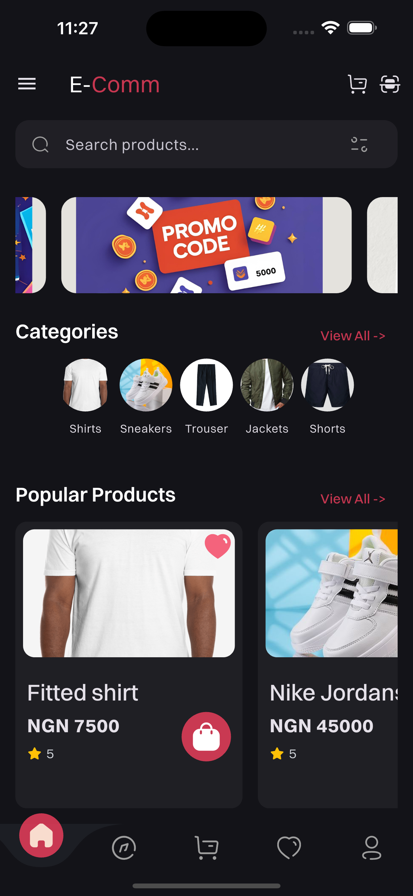
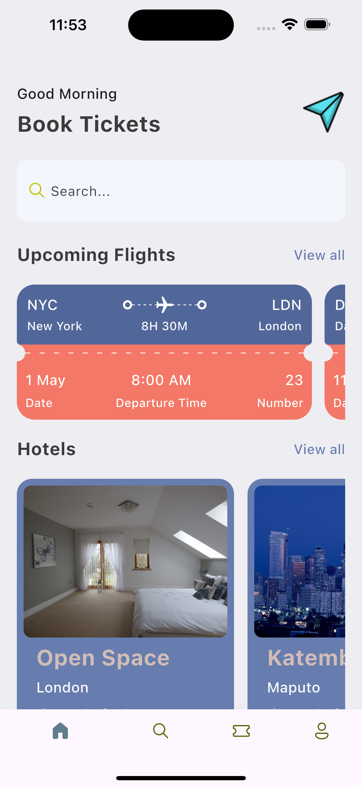
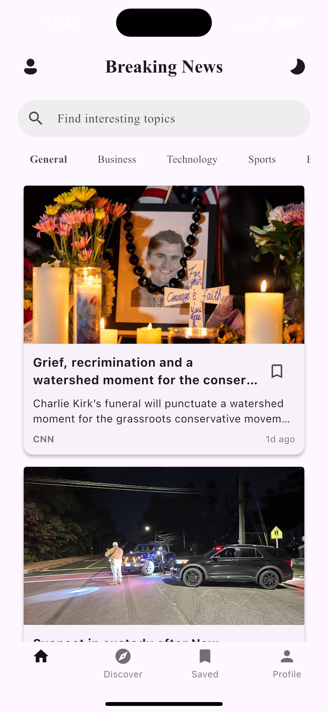
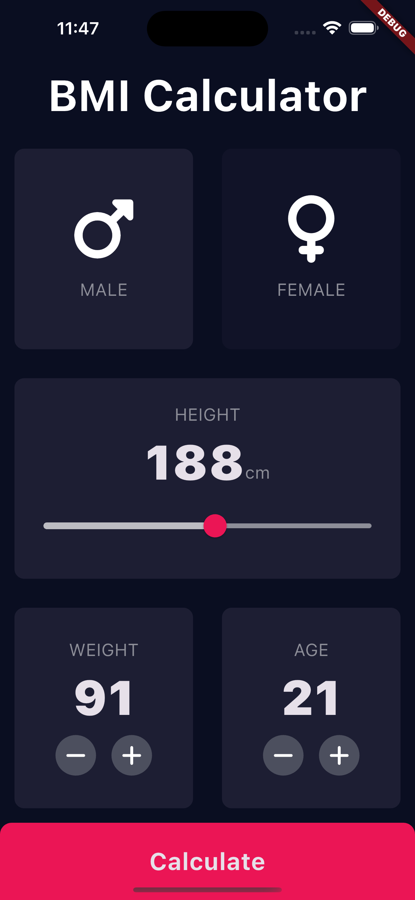

## Hi there 👋

  

###

  

###

  

###

<h1 align="center">Hey there 👋, I'm Nnaemeka Nwanna</h1>

---

### 👩‍💻 About Me

I'm a **Mobile & Backend Developer** of **Nigerian / Mozambican** heritage.  
I studied **Computer Science & Business** at **Wisconsin International University College, Ghana**.

- 🔭 Currently building **Ledgr**, an AI-powered expense tracker.
- 📚 Learning more about backend scaling, clean architecture & AI integration.
- ⚡ Love experimenting with new stacks and contributing to open-source.

---

### 🛠 Languages & Tools

  
  
  
  
  
  
  
  
  
  
  

---

### 🚀 Projects

| Project                                                     | Tech Stack          | Backend        | Tech Highlights                                                   | Links                                             | Screenshots                                              |
| ----------------------------------------------------------- | ------------------- | -------------- | ----------------------------------------------------------------- | ------------------------------------------------- | -------------------------------------------------------- |
| **Ledgr** _(Private)_                                       | Flutter, Express.js | MongoDB, Redis | AI-powered expense parsing from SMS, clean architecture, JWT auth | –                                                 | [📂 Screenshots](screenshots/ledgr/)                     |
| [E-commerce App](https://github.com/Wann-mobile/e-commerce) | Flutter             | **MongoDB**    | Product listings, cart, checkout flow, secure API                 | [Repo](https://github.com/Wann-mobile/e-commerce) |  |
| [Ticket App](https://github.com/Wann-mobile/ticket_app)     | Flutter             | –              | Ticket booking flow, seat selection, QR validation                | [Repo](https://github.com/Wann-mobile/ticket_app) |         |
| [News App](https://github.com/Wann-mobile/news-app)         | Flutter             | **Firebase**   | Realtime news feed, push notifications, category filters          | [Repo](https://github.com/Wann-mobile/news-app)   |             |
| [BMI App](https://github.com/Wann-mobile/bmi-app)           | Flutter, C++        | –              | BMI logic in C++, cross-platform support                          | [Repo](https://github.com/Wann-mobile/bmi-app)    |               |
| **University Voting App** _(WIP)_                           | Flutter             | –              | Digital elections, results dashboard, admin controls              | –                                                 | [📂 Screenshots](screenshots/voting/)                    |

> 📌 Add screenshots to `/screenshots/<project>` (e.g., `screenshots/ecommerce/home.png`).

---
