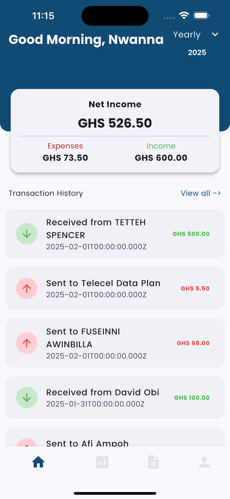
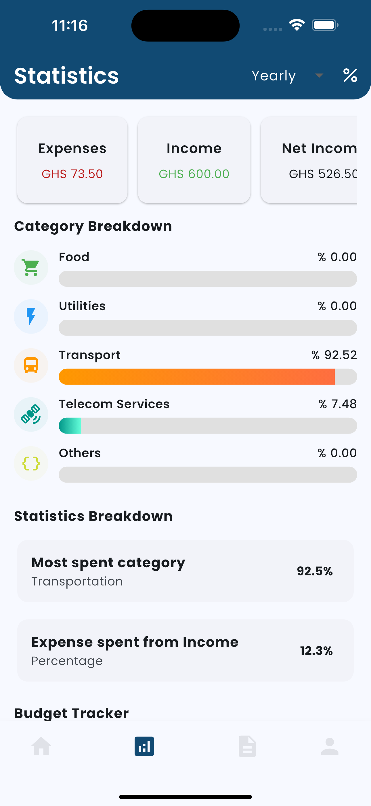
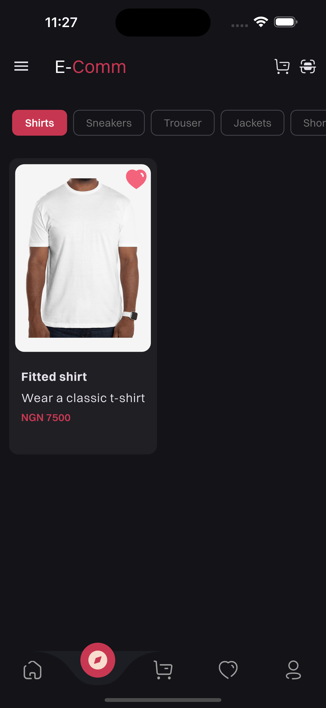
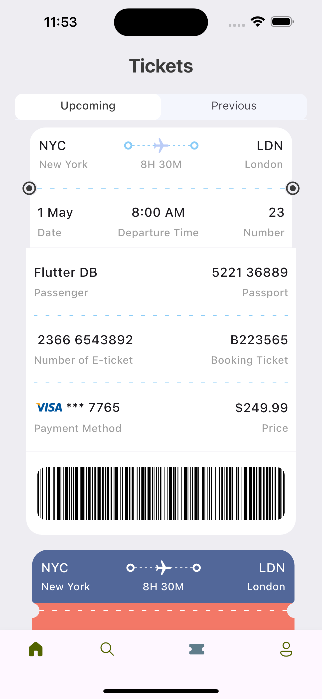
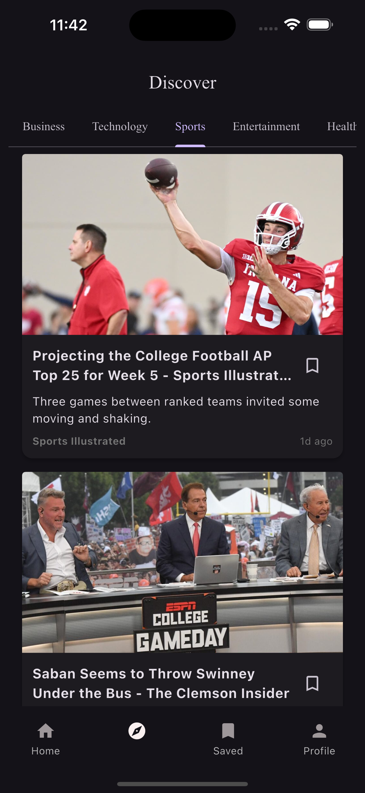
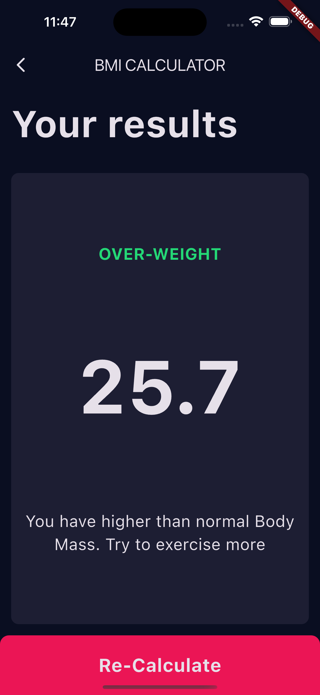

## Hi there 👋

  

###

  

###

  

###

<h1 align="center">Hey there 👋, I'm Nnaemeka Nwanna</h1>

---

### 👩‍💻 About Me

I'm a **Mobile & Backend Developer** of **Nigerian / Mozambican** heritage.  
I studied **Business management and Computer Science** at **Wisconsin International University College, Ghana**.

- 🔭 Currently building **Ledgr**, an SMS-powered expense tracker.
- 📚 Learning more about backend scaling, clean architecture & AI integration.
- ⚡ Love experimenting with new stacks and contributing to open-source.

---

### 🛠 Languages & Tools

  
  
  
  
  
  
  
  
  
  
  

---

### 🚀 Projects

| Project                                                     | Tech Stack          | Backend        | Tech Highlights                                                    | Links                                             | Screenshot 1                                         | Screenshot 2                                         |
|-------------------------------------------------------------|--------------------|----------------|--------------------------------------------------------------------|---------------------------------------------------|-----------------------------------------------------|-----------------------------------------------------|
| **Ledgr** _(Private)_                                       | Flutter, Express.js | MongoDB, Redis | SMS-powered expense parsing, clean architecture, JWT auth          | –                                                 |             |   |
| [E-commerce App](https://github.com/Wann-mobile/e-commerce) | Flutter             | **MongoDB**    | Product listings, cart, checkout, secure API                       | [Repo](https://github.com/Wann-mobile/e-commerce) |    |  |
| [Ticket App](https://github.com/Wann-mobile/ticket_app)     | Flutter             | –              | Ticket booking flow, seat selection, QR validation                 | [Repo](https://github.com/Wann-mobile/ticket_app) |           |       |
| [News App](https://github.com/Wann-mobile/news-app)         | Flutter             | **Firebase**   | Realtime news feed, push notifications, category filters           | [Repo](https://github.com/Wann-mobile/news-app)   |               |         |
| [BMI App](https://github.com/Wann-mobile/bmi-app)           | Flutter, C++        | –              | BMI logic in C++, cross-platform support                           | [Repo](https://github.com/Wann-mobile/bmi-app)    |                 |             |
| **University Voting App** _(WIP)_                           | Flutter             | –              | Digital elections, results dashboard, admin controls               | –                                                 |    |  |

---
